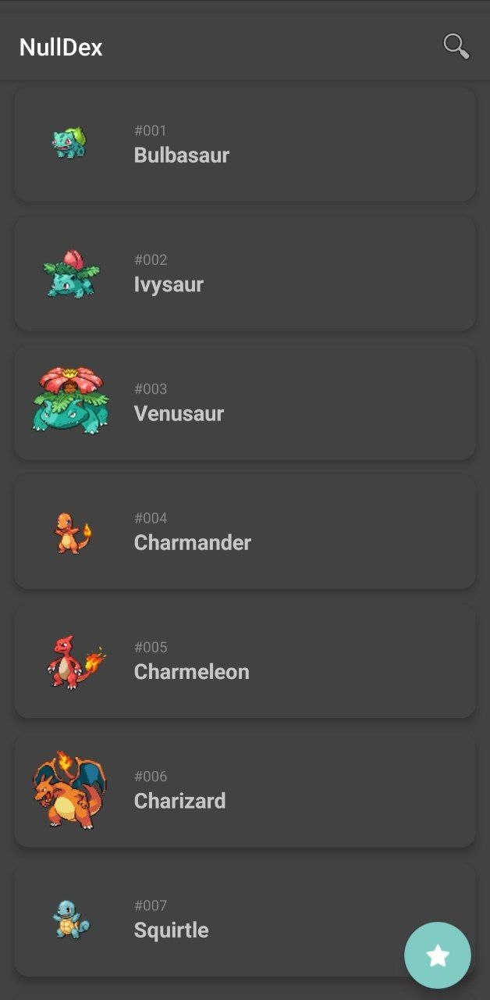
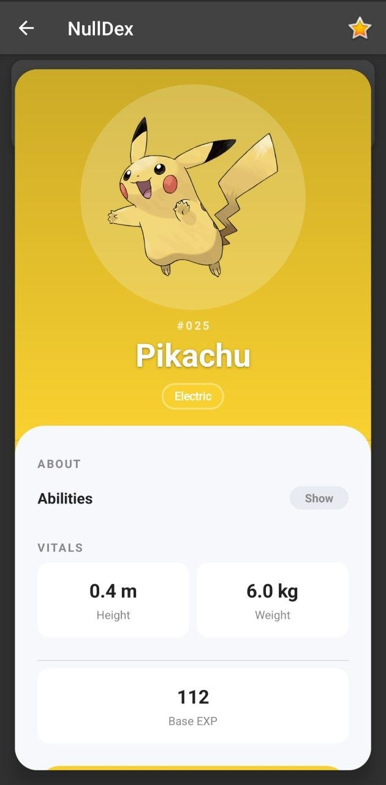

# nulldex

A Pokédex for Android. Browse every Pokémon from [PokéAPI](https://pokeapi.co/), open a type-colored detail card, and swipe it aside to go back.

[](https://kotlinlang.org/)
[](https://developer.android.com/)
[](LICENSE)

Features:

* **Infinite list** - paginated PokéAPI feed with pull-to-refresh and search
* **Detail card** - sprite, types, abilities, height, weight, and base EXP on a translucent overlay
* **Swipe to dismiss** - flick the card left or right to close it (vertical scroll still works)
* **Landscape two-pane** - list and card side by side on wide screens
* **Share & deep links** - share a card; `https://nulldex.app/pokemon/pikachu` or `nulldex://pokemon/pikachu` opens it
* **Favorites** - star Pokémon from the action bar
* **Offline cache** - PokéAPI list and detail responses are stored on disk
* **Server-driven UI** - detail layout is described by JSON, with an optional remote config URL

<div style="display: flex; gap: 20px; justify-content: center; flex-wrap: wrap; max-width: 100%;">
  <div style="flex: 1; min-width: 200px; max-width: 48%;">
    
  </div>
  <div style="flex: 1; min-width: 200px; max-width: 48%;">
    
  </div>
</div>

## How to build?

Requirements:

* Android Studio (recent)
* JDK 11
* Android SDK 36

1. Clone repository:
    
    ```bash
    git clone https://github.com/pelmesh619/nulldex.git
    ```

2. Open folder in Android Studio, sync Gradle, and run the `app` configuration on a device or emulator

    Optional live UI config (debug): set `uiBaseUrl` in `gradle.properties`, for example:
    
    ```properties
    uiBaseUrl=http://10.0.2.2:8000/
    ```

    If `uiBaseUrl` is unset, the app uses the bundled `pokemon_ui.json`

3. Optionally deploy backend on `uiBaseUrl` address:
   
    ```bash
    cd sduibackend
    pip install -r requirements.txt
    python main.py
    ```

## License

MIT

Pokémon and Pokémon character names are trademarks of Nintendo / Game Freak / The Pokémon Company. This project is a fan-made client of PokéAPI and is not affiliated with those companies
